# Vegetable Farm
## Introduction
#### Project Description
  Vegetable Farm is a statistical collection project to enable vegetable farmers collect details of daily sales of thirteen different vegetables types being cultivated on a farm (cabbage, carrot, mushroom, broccoli, cauliflower, avocado, asparagus, aubergine, tomato, cucumber, spinach, parsnip and onion). To understand and forecast daily vegetable harvest with reference to daily trade and excess. Excess references amount of each vegetable type sold out with more required to be harvested or more vegetable harvested than what was sold hence wasted as vegetables are highly perishable produce. This will enable the farmer provide fresh vegetable to customers and improved vegetable shelf life. 

  [Live version of my project, Vegetable Farm is here](https://vegetable-farm-d2f6bd1576d7.herokuapp.com/)

  
#### User Demographic
Vegetable farm data automation can be used by small to medium size vegetable farmers 
#### How to Use
Vegetable farm data automation is based on gathering statistical data used to improve farmers harvest forecast for longer vegetable shelf life.

Step 1. Run the program

Step 2. Enter trade data, collection of 13 numeric integers separated with commas

Step 3. Hit enter to run the program

Step 4. Trade worksheet auto Update

Step 5. Excess worksheet auto Update

Step 6. Harvest worksheet auto Update

Step 7. Print harvest forecast on terminal for next day

## Design
Lucid Chart to demonstrate development flow

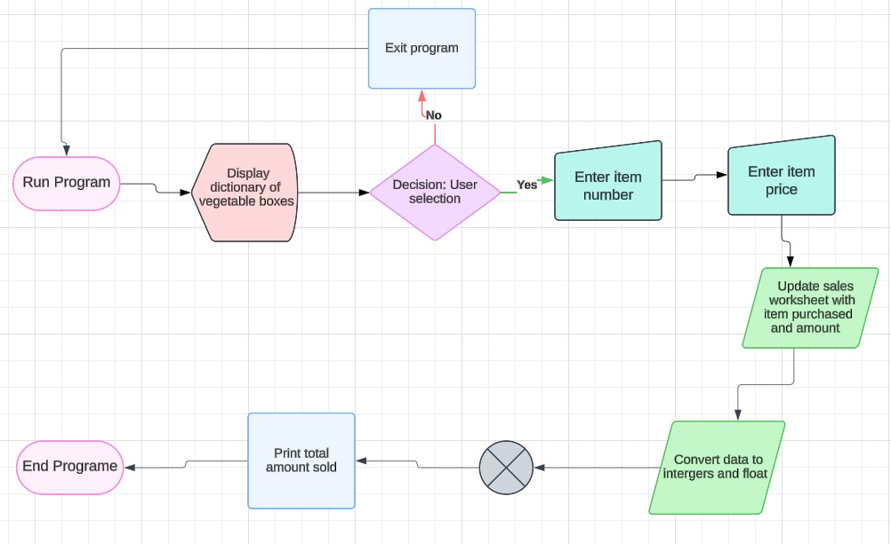
## Features
### Existing Features
#### Error handling:

      * Input must be numeric integers

      * Input must be collection of 13 numeric integers separated with commas

* Trade worksheet updated when valid record is entered

* Excess calculated and worksheet updated

* Harvest forecast calculated and worksheet updated

* Next day harvest forecast printed to terminal

### Future Features

* Forecast harvest numbers for a longer period and seasons, e.g. summer, 
  Christmas etc using average trade, harvest and excess data for several weeks.

* Convert vegetables to be weighed in tonnes  

## Data Model
The data type requirement are numeric integers. A collection of thirteen integers separated with commas, this classifies thirteen columns of farmer’s vegetables types as stated in google sheet. Trade input data __must__ be equals to thirteen collection of numeric integers separated with commas and __must__ not contain any other data type.

Daily excess is calculated by subtracting trade from harvest. Harvest forecast calculated is calculated using average  trade for last week (7 days) and a markup of 20%.

## Validation Testing
Manually tested this project by passing the code through a [PEP8 Python Linter](https://pep8ci.herokuapp.com/) and confirmed there are no Warning or Error.

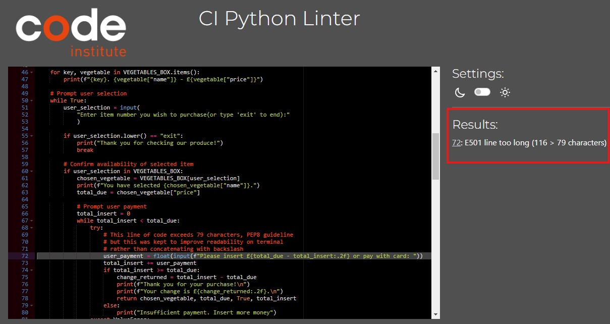

### Features Testing
 Tested on my local terminal and code institute Heroku terminal after deployment
|Key Features|   User Value   |Functionality Test|Outcome|
|:------------|:----------------|:-------------|:------------|
|Input must be numeric integers|Ensure user enters integers with no alpha or alphanumeric entries|Enter 13 trade data with alphanumeric entries|Invalid data error message 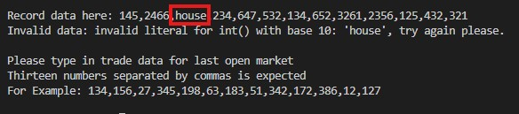|
|Input must be 13 digits separated with commas|Ensure user enters the correct number of data to match variety of vegetable on the farm|Enter integers that are not equal to 13 entries|Invalid data error message 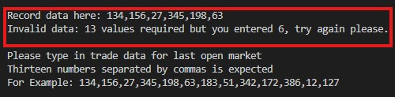|
|Trade worksheet updated when valid data is entered|Automatically update trade worksheet to with to match details entered for each vegetable|Enter valid data: 13 integers separated with commas|Valid data message printed on terminal and updates worksheet 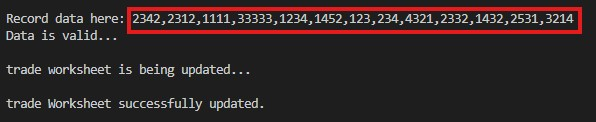 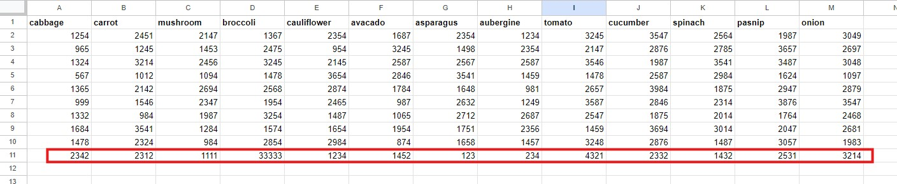|
|Calculated excess and updated worksheet|Automatically calculate excess by subtracting trade from harvest and update worksheet |Enter valid data: 13 integers separated with commas|Excess progression tasks  printed on terminal and excess worksheet updated  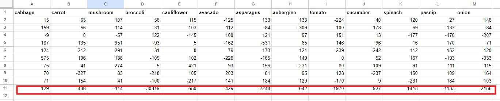|
|Harvest with 20% forecast  calculated and worksheet updated|Automatically calculate average harvest with 20% markup |Enter valid data: 13 integers separated with commas|Harvest progression tasks printed on terminal and harvest worksheet updated 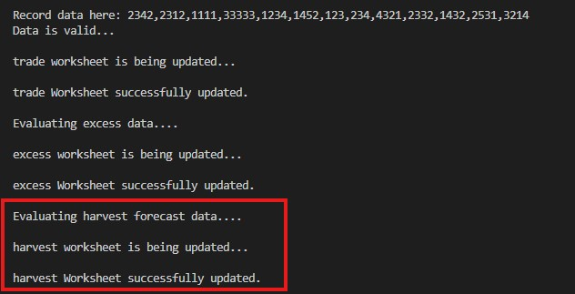 |

## Technologies Used

[Heroku](https://id.heroku.com/login)

[Lucid Chart](https://www.lucidchart.com/)
### Languages Used
[Python](https://en.wikipedia.org/wiki/Python_(programming_language))
## Bugs
#### Bugs Resolved
* For get_last_week_trade function column count, initially used range(0, 12) to pull last 7 days trade data for 13 vegetable columns thinking that function works just lists zero index. However this was not pulling trade data for all 13 columns. 
It was fixed by using range (1, 14)

#### Bugs Unresolved
There are no unresolved bug
## Deployment
### Deployment Steps

* To enable Heroku build the project, create dependency list on requirement.txt file in workspace using pip3 freeze > requirements.txt command

   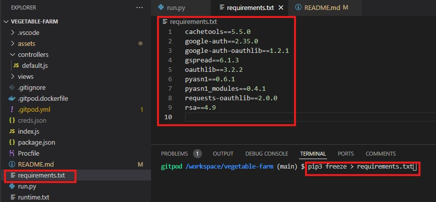

* Sign into Heroku and create a new app.

    

* Add App name (vegetable-farm) and choose region (Europe)
  
* Go to settings tab to add Config Var

   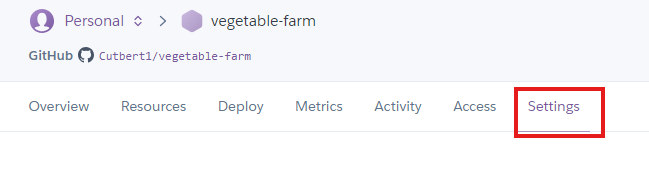
      
* Add credential json KEY and VALUE

   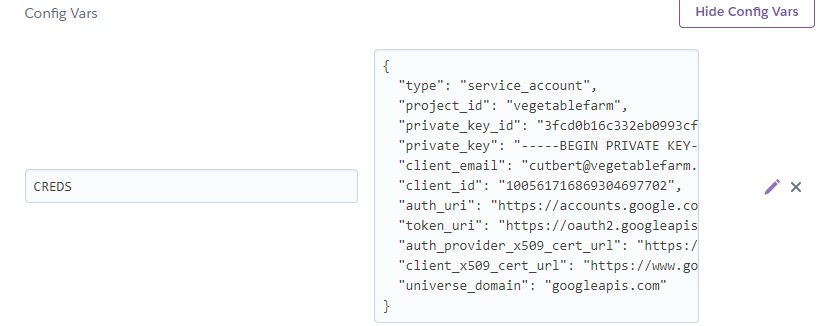

* Add another config Var to set KEY as PORT and VALUE as 8000

   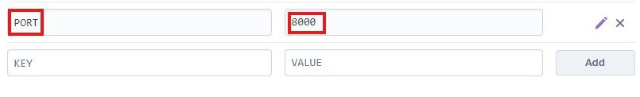

* Go to Deploy tab to continue deployment

   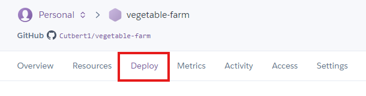

* Link Heroku App to GitHub repository

   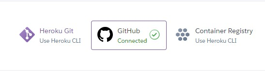

* Search for GitHub repository (vegetable-farm)

* Click on deploy branch

  

## Credits
### Codes
Code Institute [Love Sandwiches Tutorial](https://github.com/Code-Institute-Solutions/love-sandwiches-p5-sourcecode/tree/master/02-accessing-user-data/05-updating-our-sales-worksheet)
### Tutorials
* Code Institute Python Essentials

* [stackoverflow](https://stackoverflow.com/questions/23739224/empty-heading-warning-on-html5-validation)

* Tutor Support 

