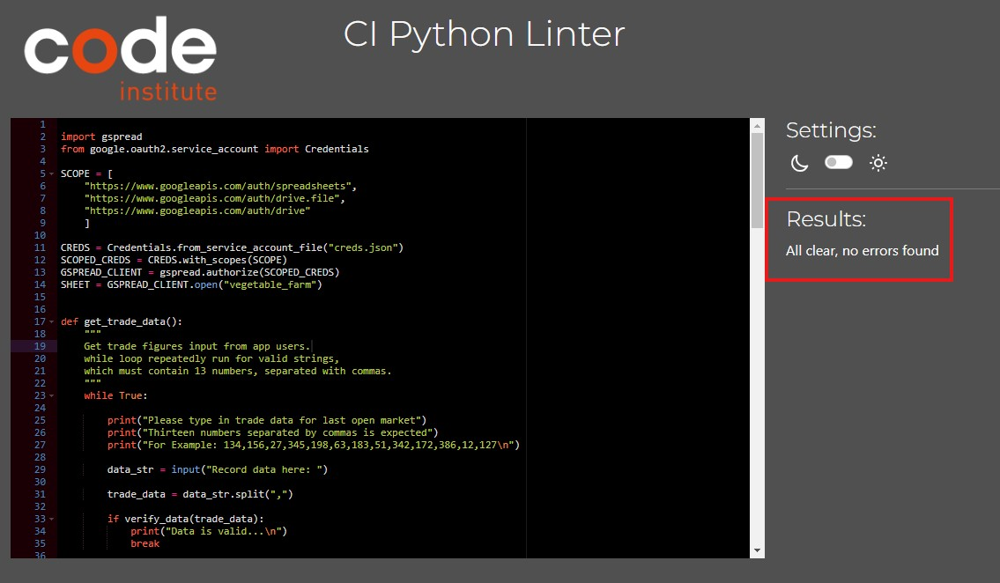

# Vegetable Farm
## Introduction
#### Project Description
  Vegetable Farm is a statistical collection project to enable a vegetable farmer collect details of daily sales of 13 different vegetables being cultivated on his farm (cabbage, carrot, mushroom, broccoli, cauliflower, avocado, asparagus, aubergine, tomato, cucumber, spinach, pasnip and onion) types. To understand and forecast daily vegetable harvest with reference to daily sales and excess. Excess is references amount of each vegetable type sold out with more required to be harvested or more vegetable harvested than what was sold. This will enable the farmer provide fresh vegetable to customers and improved vegetable shelve life. 

  Here is a live version of my project
#### User Demographic
Vegetable farm data automation can be used by small to medium size vegetable farmers 
#### How to Use
Vegetable farm data automation is based on gathering statistical data used to improve farmers harvest forecast for longer vegetable shelve life.
Step 1. Run the program

Step 2. Enter trade data, 13 integers separated with commas

Step 3. Hit enter to run the program

Step 4. Trade worksheet auto Update

Step 5. Excess worksheet auto Update

Step 6. Harvest worksheet auto Update

## Design
Lucid Chart to demonstrate development flow

## Features
### Existing Features
* #### Error handling:

Input must be integers

Input must be 13 values separated with commas

* Trade worksheet is updated when valid record is entered

* Excess is calculated and worksheet updated

* Harvest and forecast is calculated and worksheet updated

## Validation Testing
Manually tested this project by passing the code through a PEP8 linter and confirmed there are no problem

### Features Testing

|Key Features|   User Value   |Functionality Test|Outcome|
|:------------|:----------------|:-------------|:------------|
|Input must be integers|Ensure user enters integers with no alpha or alpahnumeric entries|Enter 13 trade data with alphanumberic emtries|Invalid data error message |
|Input must be 13 digits separated with commas|Ensure user enters the correct number of data to match variety of vegetable on the farm|Enter integers that are not equal to 13 entries|Invalid data error message |
|Trade worksheet updated when valid data is entered|Automatically update trade worksheet to with to match details entered for each vegetable|Enter valid data: 13 integers separated with commas|Valid data message printed on terminal and updates worksheet  |
|Calculated excess and updated worksheet|Automatically calculate excess by subtracting trade from harvest and update worksheet |Enter valid data: 13 integers separated with commas|Excess progression tasks  printed on terminal and excess worksheet updated  |
|Harvest with 20% forecast  calculated and worksheet updated|Automatically calculate average harvest with 20% markup |Enter valid data: 13 integers separated with commas|Harvest progression tasks printed on terminal and harvest worksheet updated  |

## Technologies Used

[Heroku](https://id.heroku.com/login)

[Lucid Chart](https://www.lucidchart.com/)
### Languages Used
[Python](https://en.wikipedia.org/wiki/Python_(programming_language))
## Bugs
#### Bugs Resolved
#### Bugs Unresolved
### Libraries
## Deployment
## Credits
### Codes
### Tutorials

Welcome,

This is the Code Institute student template for deploying your third portfolio project, the Python command-line project. The last update to this file was: **May 14, 2024**

## Reminders

- Your code must be placed in the `run.py` file
- Your dependencies must be placed in the `requirements.txt` file
- Do not edit any of the other files or your code may not deploy properly

## Creating the Heroku app

When you create the app, you will need to add two buildpacks from the _Settings_ tab. The ordering is as follows:

1. `heroku/python`
2. `heroku/nodejs`

You must then create a _Config Var_ called `PORT`. Set this to `8000`

If you have credentials, such as in the Love Sandwiches project, you must create another _Config Var_ called `CREDS` and paste the JSON into the value field.

Connect your GitHub repository and deploy as normal.

## Constraints

The deployment terminal is set to 80 columns by 24 rows. That means that each line of text needs to be 80 characters or less otherwise it will be wrapped onto a second line.

---

Happy coding!
