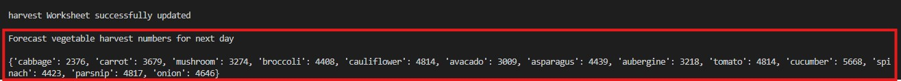

# Vegetable Farm
## Introduction
#### Project Description
 Project is a vegetable sales system to enable farmers sell vegetable produce. Currently there are thirteen different vegetables types being cultivated on this farm (cabbage, carrot, mushroom, broccoli, cauliflower, avocado, asparagus, aubergine, tomato, cucumber, spinach, parsnip and onion), hence ready for sell in boxes. Users are expected to use this system to purchase any vegetables of their choice available for sale. 
Famer can also use the system to understand total daily sales at the end of each market day.

  [Live version of my project, Vegetable Farm is here](https://vegetable-farm-d2f6bd1576d7.herokuapp.com/)

  
#### User Demographic
Vegetable farm produce sales system can be used by small to medium size vegetable farmers 
#### How to Use
Vegetable farm produce sales system is used for easy self-serve vegetable purchase. It can also be used by back office (famer) to understand daily sales, hence facilitate daily farmers vegetable availability planning.

Step 1. Run the program (python3 run.py)

Step 2. From the dispplayed items, enter item number of your choice

Step 3. Hit enter to run the program

Step 4. Enter amount displayed for your selected item

Step 5. Hit enter to run the program

Step 6. If amount entered is not sufficient, program will display remaining amount and request user input

Step 7. If amount entered is greater than produce price program will return balance

Step 8. Hit enter once correct amount is entered

Step 9. Sales worksheet auto update with item and amount 

**Back-Office**
Step 10. Program total amount sold at end of each market day

## Design
Lucid Chart to demonstrate development flow

## Features
### Existing Features
#### Error handling:

      * Input must be item number

      * Input amount must be >= price of vegetable
 
      * Sales worksheet values for total daily sum must be integers or float

### Future Features

* Convert vegetables to be weighed in tonnes for large vegetable farmers 

## Data Model
Google sheet containing one sales worksheet  was used were vegetables names are updated with corresponding purchased value and sum of total amount sold for back office use.

## Validation Testing
Manually tested this project by passing the code through a [PEP8 Python Linter](https://pep8ci.herokuapp.com/) and confirmed there are no Warning or Error.

### Features Testing
 Tested on my local terminal and code institute Heroku terminal after deployment
|Key Features|   User Value   |Functionality Test|Outcome|
|:------------|:----------------|:-------------|:------------|
|Input must be numeric integers|Ensure user enters integers with no alpha or alphanumeric entries|Enter 13 trade data with alphanumeric entries|Invalid data error message |
|Input must be 13 digits separated with commas|Ensure user enters the correct number of data to match variety of vegetable on the farm|Enter integers that are not equal to 13 entries|Invalid data error message |
|Trade worksheet updated when valid data is entered|Automatically update trade worksheet to with to match details entered for each vegetable|Enter valid data: 13 integers separated with commas|Valid data message printed on terminal and updates worksheet  |
|Calculated excess and updated worksheet|Automatically calculate excess by subtracting trade from harvest and update worksheet |Enter valid data: 13 collection of integers separated with commas|Excess progression tasks  printed on terminal and excess worksheet updated  |
|Harvest with 20% forecast  calculated and worksheet updated|Automatically calculate average harvest with 20% markup |Enter valid data: 13 collection of integers separated with commas|Harvest progression tasks printed on terminal and harvest worksheet updated  |
|Print vegetable types and corresponding next day harvest forecast on terminal|Print next day vegetable harvest numbers on terminal|Enter valid data: 13 collection of integers separated with comma|Vegetable types and corresponding next day harvest forecast printed on terminal |

## Technologies Used

[Heroku](https://id.heroku.com/login)

[Google Sheet](https://docs.google.com/spreadsheets)

### Languages Used
[Python](https://en.wikipedia.org/wiki/Python_(programming_language))
## Bugs
#### Bugs Resolved
* For get_last_week_trade function column count, initially used range(0, 12) to pull last 7 days trade data for 13 vegetable columns thinking that function works just lists zero index. However this was not pulling trade data for all 13 columns. 
It was fixed by using range (1, 14)

#### Bugs Unresolved
There are no unresolved bug
## Deployment
### Deployment Steps

* To enable project to build, create dependency list on requirement.txt file in workspace using pip3 freeze > requirements.txt command

   

* Fork or clone vegetable-farm repository

* Sign into Heroku and create a new app.

    

* Add App name (vegetable-farm) and choose region (Europe)
  
* Go to settings tab to add Config Var

   
      
* Add credential json KEY and VALUE

   

* Add another config Var to set KEY as PORT and VALUE as 8000

   

* Go to Deploy tab to continue deployment

   

* Link Heroku App to GitHub repository

   

* Search for GitHub repository (vegetable-farm)

* Click on deploy branch

  

## Credits
### Codes
Code Institute [Love Sandwiches Tutorial](https://github.com/Code-Institute-Solutions/love-sandwiches-p5-sourcecode/tree/master/02-accessing-user-data/05-updating-our-sales-worksheet)
### Tutorials
* Code Institute Python Essentials

* [stackoverflow](https://stackoverflow.com/questions/23739224/empty-heading-warning-on-html5-validation)

* Tutor Support 

