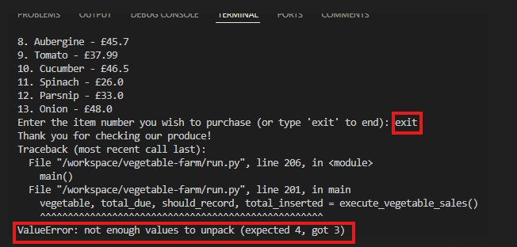
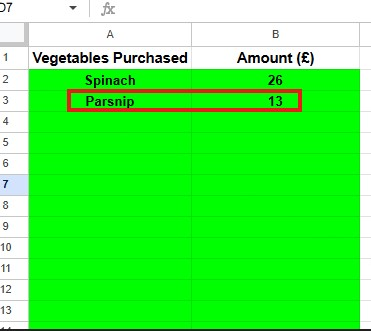

# Vegetable Farm
## Introduction
#### Project Description
 Project is a vegetable sales system to enable farmers sell vegetable produce. Currently there are thirteen different vegetables types being cultivated on this farm (cabbage, carrot, mushroom, broccoli, cauliflower, avocado, asparagus, aubergine, tomato, cucumber, spinach, parsnip and onion), hence ready for sell in boxes. Users are expected to use this system to purchase any vegetables of their choice available for sale. 
Famer can also use the system to understand total daily sales at the end of each market day.

  [Live version of my project, Vegetable Farm is here](https://vegetable-farm-d2f6bd1576d7.herokuapp.com/)

  
#### User Demographic
Vegetable farm produce sales system can be used by small to medium size vegetable farmers 
#### How to Use
Vegetable farm produce sales system is used for easy self-serve vegetable purchase. It can also be used by back office (famer) to understand daily sales, hence facilitate daily farmers vegetable availability planning.

Step 1. Run the program (python3 run.py)

Step 2. From the dispplayed items, enter item number of your choice

Step 3. Hit enter to run the program

Step 4. Enter amount displayed for your selected item

Step 5. Hit enter to run the program

Step 6. If amount entered is not sufficient, program will display remaining amount and request user input

Step 7. If amount entered is greater than produce price program will return balance

Step 8. Hit enter once correct amount is entered

Step 9. Sales worksheet auto update with item and amount 

**Back-Office**
Step 10. Program total amount sold at end of each market day

## Design
Lucid Chart to demonstrate development flow

## Features
### Existing Features
#### Error handling:

      * Input must be item number

      * Input amount must be >= price of vegetable
 
      * Sales worksheet values for total daily sum must be integers or float

      *Input must be integer or float

### Future Features

* Convert vegetables to be weighed in tonnes for large vegetable farmers 

## Data Model
Google sheet containing one sales worksheet  was used were vegetables names are updated with corresponding purchased value and sum of total amount sold for back office use.

## Validation Testing
Manually tested this project by passing the code through a [PEP8 Python Linter](https://pep8ci.herokuapp.com/) and confirmed there are no Warning or Error. However a line of code exceeds 79 characters PEP8 guideline but this was kept to improve readability on terminal rather than concatenating with backslash

### Features Testing
 Tested on my local terminal and code institute Heroku terminal after deployment
|Key Features|   User Value   |Functionality Test|Outcome|
|:------------|:----------------|:-------------|:------------|
|Input must be item number|Ensure user enter item number matching any of the displayed available vegetables|Enter vegetable_box item number that isn’t displayed |Invalid selection error message |
|Input amount must be >= price of vegetable|Ensure amount entered must be greater than or equal to price of vegetable displayed|Enter amount not equal to a greater than price of vegetable displayed|Insufficient payment error message|
|Return balance when user input amount > price of vegetable displayed|Ensure amount balance is provided to the user when money inserted is > than the price of vegetable|Enter amount > than price of vegetable displayed|Amount balance returned to the user |
|Update sales worksheet with name of vegetable purchased and amount|Automatically update sales worksheet |Enter valid vegetable number and sufficient amount for the price of item selected|Sales worksheet progression task printed to terminal and worksheet updated  |
|Total daily sales calculated and print to terminal for back office use|Automatically calculate total purchase value in real time and print to terminal |Enter valid vegetable number and sufficient amount for the price of item selected|Calculate total purchase value in real time and print to terminal |
|Input must be integer or float|Ensure data entered must be integer or float when program payment |Enter non-integer or float when program request payment |Invalid payment error message |

## Technologies Used

[Heroku](https://id.heroku.com/login)

[Google Sheet](https://docs.google.com/spreadsheets)

### Languages Used
[Python](https://en.wikipedia.org/wiki/Python_(programming_language))
## Bugs
#### Bugs Resolved
|Bug|   Description |Solution Applied|Result|
|:------------|:----------------|:-------------|:------------|
|Program thows error when user exit|After vegetable_box display ready for selection, user is advised to type “exit” if they do not want to proceed. Program throws us ValueError when user enters “exit" |On the while True, if statement for “exit” was returning None, 0 and False.  Updated the code with break, hence end the program once user exit and commented out return values. |Bug resolved |
|Sales worksheet being updated with only additional amount|When insufficient fund is entered and program request user for additional money worksheet was being updated only  with additional amount entered  |Add total_insert variable on the conditional statements |Bug resolved  |

#### Bugs Unresolved
There are no unresolved bug
## Deployment
### Deployment Steps

* To enable project to build, create dependency list on requirement.txt file in workspace using pip3 freeze > requirements.txt command

   

* Fork or clone vegetable-farm repository

* Sign into Heroku and create a new app.

    

* Add App name (vegetable-farm) and choose region (Europe)
  
* Go to settings tab to add Config Var

   
      
* Add credential json KEY and VALUE

   

* Add another config Var to set KEY as PORT and VALUE as 8000

   

* Go to Deploy tab to continue deployment

   

* Link Heroku App to GitHub repository

   

* Search for GitHub repository (vegetable-farm)

* Click on deploy branch

  

## Credits
### Tutorials
* Code Institute Python Essentials

* [stackoverflow](https://stackoverflow.com/questions/23739224/empty-heading-warning-on-html5-validation)

* Tutor Support 

